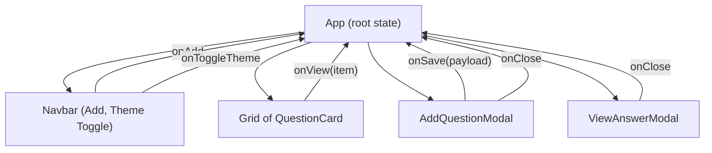

# Futuristic Question Hub - Documentation

## Overview
Futuristic Question Hub is a single-page React application that enables users to add and view question–answer pairs in a clean, modern interface. The app features a fixed top navigation bar with an “Add Question” action, a responsive grid of question cards, and accessible modal dialogs for adding and viewing content. It uses localStorage to persist user data and supports a light/dark theme toggle via CSS variables.

This document describes the implemented features, the architecture and component structure, state management and persistence, styling and theme guidance, accessibility considerations, environment variables usage, how to run and test the application, deployment notes, future enhancements, and troubleshooting tips.

## Features
The application provides:
- Add Question: Quickly add a question and its answer using an accessible modal form with basic validation.
- View Answer: Open a read-only modal that presents the answer for a selected question.
- Persistent Storage: Questions and preferences are saved in localStorage and survive page reloads.
- Theme Toggle: Switch between light and dark themes. The selected theme is persisted in localStorage.
- Responsive Layout: Questions display as futuristic cards in a responsive grid.
- Accessible Modals: Modal dialogs provide proper aria semantics, focus handling, and escape/overlay dismissal.

## Getting Started
Prerequisites:
- Node.js 16+ and npm

Install dependencies and run locally:
- cd futuristic-question-hub-50490-50499/react_frontend
- npm install
- npm start
  - App runs on http://localhost:3000

Run tests:
- npm test
  - Runs React Scripts’ test runner with @testing-library/jest-dom configured via src/setupTests.js.

Build for production:
- npm run build
  - Creates an optimized production bundle in the build directory.

## Project Structure
Key files and directories:

- react_frontend/
  - package.json: Defines dependencies and scripts for start/test/build.
  - src/
    - index.js: React entry point, renders App.
    - index.css: Base font and reset styles.
    - App.js: Root component managing theme, questions list, and modal visibility.
    - App.css: Main styling, including CSS variables and component styles.
    - App.test.js: Integration-style tests verifying key flows (add/view).
    - setupTests.js: Jest DOM matchers setup for tests.
    - components/
      - Navbar.js: Fixed top navigation bar with title, Add button, optional theme toggle.
      - QuestionCard.js: Displays question with creation time and a “View Answer” action.
      - Modal.js: Accessible modal wrapper with focus handling, escape/overlay dismiss.
      - AddQuestionModal.js: Form modal to create a new question-answer pair with validation.
      - ViewAnswerModal.js: Read-only modal to display a question’s answer.
    - hooks/
      - useLocalStorage.js: Custom hook to sync state with localStorage.
    - utils/
      - env.js: Helper to read selected REACT_APP_* environment variables at runtime.

## Architecture & Data Flow
At the highest level, App coordinates the main UI and state. It composes the Navbar and renders either an empty state or a grid of QuestionCard components. Two modals—AddQuestionModal and ViewAnswerModal—are controlled by App’s state. The application state and data persistence flow is:

- Theme State:
  - App uses useLocalStorage('theme', 'light') to load and persist the theme.
  - When theme changes, App sets a data-theme attribute on the document element.
  - CSS variables switch based on data-theme to implement light/dark modes.

- Questions State:
  - App uses useLocalStorage('questions', []) to persist an array of { id, createdAt, question, answer } objects.
  - Items are saved as JSON in localStorage and restored on load by the useLocalStorage hook.
  - New questions are created in onSaveAdd with a unique id (using crypto.randomUUID if available, otherwise Date.now) and an ISO timestamp.

- Modals State:
  - isAddOpen controls the add modal visibility.
  - viewing holds the currently selected item for the answer modal (or null when closed).
  - App passes handlers to open/close the modals and to save data.

- Environment Variables:
  - getEnv() returns a whitelist of REACT_APP_* values (if present in the build environment).
  - When REACT_APP_LOG_LEVEL is “debug”, App logs the environment object to console.debug on mount.
  - No backend calls are made; environment variables are currently informational or reserved for future integration.

### Mermaid: Component Interaction Overview

## Components
### App (src/App.js)
- Purpose: Root component that maintains the core application state including theme, questions, and modal visibility. It renders Navbar, content grid, and modals.
- Key behaviors:
  - Theme toggling with data-theme and CSS variables.
  - localStorage persistence for theme and questions via useLocalStorage hook.
  - Sorting questions by createdAt (newest first).
  - Safe environment variable inspection via getEnv().

### Navbar (src/components/Navbar.js)
- Purpose: Fixed top navigation bar with the app title and primary actions.
- Props:
  - onAdd: function to open AddQuestionModal.
  - onToggleTheme: function to toggle theme (optional).
  - theme: 'light' | 'dark' current theme.
- Behavior: Renders an “Add Question” button and a theme toggle button if provided.

### QuestionCard (src/components/QuestionCard.js)
- Purpose: Compact card showing question title and creation time with a “View Answer” button.
- Props:
  - item: { id, question, answer, createdAt }
  - onView: function to open ViewAnswerModal for this item.
- Behavior: Formats the createdAt time and calls onView when clicked.

### Modal (src/components/Modal.js)
- Purpose: Accessible modal wrapper handling ESC to close, overlay click to close, and focus management on open.
- Props:
  - open: boolean to show/hide.
  - title: string for header.
  - ariaLabel: accessible label for dialog.
  - onClose: close handler.
  - footer: footer node (e.g., action buttons).
  - children: modal body.
- Behavior: Adds keydown listener for Escape; focuses modal on open.

### AddQuestionModal (src/components/AddQuestionModal.js)
- Purpose: Form modal to create a question and answer with required-field validation.
- Props:
  - open, onClose, onSave(payload: {question, answer})
- Behavior:
  - Resets form on open.
  - Disables Save until both fields have non-empty trimmed values.
  - Marks fields aria-invalid when touched and empty.
  - Announces validation via visually hidden alert paragraph.

### ViewAnswerModal (src/components/ViewAnswerModal.js)
- Purpose: Read-only modal to display an answer for a selected question.
- Props:
  - open, item, onClose
- Behavior: Shows answer content as pre-wrapped text and provides a Close action.

## State Management & Persistence
The application uses React hooks and a minimal custom hook for persistence:

- useLocalStorage (src/hooks/useLocalStorage.js):
  - Reads a JSON value from localStorage on mount (key), falling back to initialValue on errors or missing keys.
  - Provides setValue that updates both state and localStorage (JSON-serialized).
  - Handles function-updater patterns.
  - Ignores write errors silently for resilience.

State usage:
- App: 
  - const [theme, setTheme] = useLocalStorage('theme', 'light')
  - const [questions, setQuestions] = useLocalStorage('questions', [])

Persistence considerations:
- Stored data schema:
  - Theme: 'light' | 'dark'
  - Questions: Array of items: { id: string, createdAt: ISOString, question: string, answer: string }
- Backward compatibility: If schema changes in the future, implement migration logic in useLocalStorage or a data bootstrapping layer.

## Styling & Theming
The UI is styled exclusively using CSS with variables, enabling a futuristic look with gradients and soft shadows. Primary colors and surfaces are defined in src/App.css:

- Light theme variables:
  - --primary: #3b82f6
  - --success: #06b6d4
  - --background: #f9fafb
  - --surface: #ffffff
  - --text: #111827
  - --muted: #6b7280
  - --border: #e5e7eb
  - --shadow: 0 10px 25px rgba(0,0,0,0.08)

- Dark theme variables (under [data-theme="dark"]):
  - --background: #0b1220
  - --surface: #0f172a
  - --text: #e5e7eb
  - --muted: #94a3b8
  - --border: #1f2937
  - --shadow: 0 10px 25px rgba(0,0,0,0.5)

Theme toggle:
- App toggles the HTML document’s data-theme attribute between light and dark.
- All theme-aware rules derive from CSS variables, so components respond automatically.

Component styling highlights:
- Navbar: fixed, semi-transparent gradient with blur backdrop.
- Buttons: subtle transform and shadow on hover; primary gradient background for emphasis.
- Cards: soft borders, background gradients, and shadow for a futuristic feel.
- Modals: centered with overlay, rounded corners, borders, and shadow; header and footer sections.
- Forms: focus ring via --focus shadow; basic validation semantics via aria attributes.

## Accessibility
The application implements accessible patterns in several places:
- Landmark roles: Navbar uses role="navigation" with aria-label="Main".
- Dialog semantics: Modal sets role="dialog", aria-modal="true", and an accessible label via ariaLabel or aria-labelledby.
- Focus management: Modal focuses the dialog container on open to assist keyboard and screen reader users.
- Keyboard support: ESC key closes the modal; clicks on the overlay also close it.
- Form labels: Inputs and textarea are associated to labels via htmlFor/id attributes.
- Validation: Required fields set aria-invalid when empty after interaction; a visually hidden alert describes validation errors when attempting to save with empty fields.
- Buttons: All interactive elements have accessible names and labels; the theme toggle includes a descriptive aria-label.

## Environment Variables
Environment variables are read via src/utils/env.js using a whitelist. The following keys are supported for reading:
- REACT_APP_API_BASE
- REACT_APP_BACKEND_URL
- REACT_APP_FRONTEND_URL
- REACT_APP_WS_URL
- REACT_APP_NODE_ENV
- REACT_APP_NEXT_TELEMETRY_DISABLED
- REACT_APP_ENABLE_SOURCE_MAPS
- REACT_APP_PORT
- REACT_APP_TRUST_PROXY
- REACT_APP_LOG_LEVEL
- REACT_APP_HEALTHCHECK_PATH
- REACT_APP_FEATURE_FLAGS
- REACT_APP_EXPERIMENTS_ENABLED

Current usage:
- The app does not currently call any backend and does not depend on these values for functionality.
- On mount, App inspects getEnv() and, if REACT_APP_LOG_LEVEL === "debug", logs the environment object to the console.

Future backend integration ideas:
- REACT_APP_API_BASE / REACT_APP_BACKEND_URL / REACT_APP_WS_URL: Base URLs for HTTP and WebSocket endpoints to fetch, persist, or stream question-answer data.
- REACT_APP_FEATURE_FLAGS / REACT_APP_EXPERIMENTS_ENABLED: Toggle advanced features (e.g., categories, search, realtime updates) without code changes.
- REACT_APP_LOG_LEVEL: Control client logging verbosity (e.g., error/warn/info/debug).
- REACT_APP_HEALTHCHECK_PATH: Provide a health check endpoint to probe the app or a backing service.
- REACT_APP_ENABLE_SOURCE_MAPS: Control source map generation in production builds to aid debugging.
- REACT_APP_PORT / REACT_APP_TRUST_PROXY / REACT_APP_FRONTEND_URL: Useful in hosting and reverse proxy scenarios (note: CRA builds are static; these may influence container runtime or hosting platform configs rather than client code).

Note: In Create React App builds, environment variables must be prefixed with REACT_APP_ to be exposed at build time.

## Testing
Tests live alongside the app in src/App.test.js and use @testing-library/react and @testing-library/jest-dom:

What is tested:
- Navbar renders app title and the “Add Question” button.
- Opening the Add Question modal and adding a question updates the UI.
- Viewing an answer opens the answer modal and displays the content.

How to run:
- npm test

Guidance for adding tests:
- Prefer testing user interactions over implementation details.
- Use screen.getByRole and screen.getByLabelText selectors to encourage accessible markup.
- Extend coverage by testing theme toggling persistence and sorting order for multiple questions.

## Deployment notes
- Production build: Use npm run build to generate static assets in the build folder.
- Hosting: Any static hosting provider (Netlify, Vercel, GitHub Pages, S3 + CloudFront, Nginx) can serve the build output.
- Environment variables: Since they are inlined at build time for CRA, set REACT_APP_* variables in the environment before running npm run build.
- Caching: Consider long-term caching for static assets with appropriate cache-control headers. Ensure index.html is cache-busted or short-lived to pick up new releases.

## Future Enhancements
- Data Management:
  - Backend Integration: Replace localStorage with a real API using REACT_APP_API_BASE for persistence and multi-user support.
  - Sync/Realtime: Add WebSocket support (REACT_APP_WS_URL) to reflect updates across clients.
- Features:
  - Edit/Delete Questions: Provide card actions to update or remove entries with confirmations.
  - Search/Filter: Client-side search of questions; categories or tags for organization.
  - Import/Export: JSON export/import of question sets.
- UX/Accessibility:
  - Keyboard Focus Trap: Enhance modal focus trapping beyond initial focus for fully contained keyboard navigation.
  - Toast Notifications: Indicate successful saves and other actions.
- Quality:
  - E2E Tests: Add Cypress or Playwright tests for end-to-end flows.
  - Performance: Code-split larger feature areas if the app grows.

## Troubleshooting
- npm start fails or app doesn’t load:
  - Ensure Node.js and npm are installed and versions are compatible (Node 16+).
  - Run npm install to ensure dependencies are present.
- Environment variables not applied:
  - In CRA, variables must be prefixed with REACT_APP_ and set before build/start. Rebuild after changes to env values.
- Tests fail unexpectedly:
  - Ensure you have not changed accessible roles/names in components. Update tests to reflect intentional UI wording changes.
- Modal not closing:
  - Modal closes on ESC and overlay click. Verify onClose handlers are passed and not shadowed.
- Theme not toggling:
  - Confirm localStorage is available and not blocked. Check that data-theme is changing on the document element.
